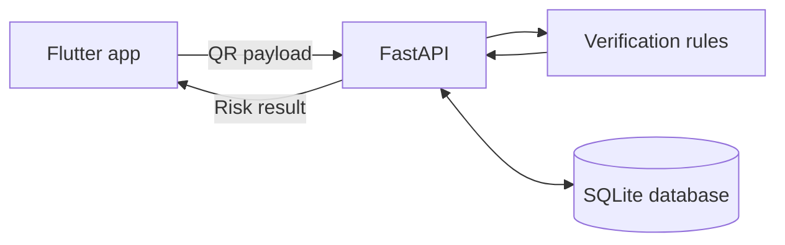

<div align="center">
  

  # Safe Scan QR

  **Scan smarter. Check risk before you trust a QR code.**

  A Flutter mobile application connected to a FastAPI backend for QR payment
  verification, merchant checking and rule-based risk scoring.

  <p>
    
    
    
    
  </p>

  
  
</div>

---

## About the project

QR codes are convenient, but the destination or payment information inside a
code may be misleading. Safe Scan QR demonstrates a verification flow that
extracts QR data, checks merchant details, applies transparent risk rules and
returns a result before the user continues.

> [!NOTE]
> This is an academic and portfolio prototype. Its score is an advisory result,
> not bank approval or a guarantee that a payment or website is safe.

## Features

| Feature | Description |
| --- | --- |
| **Live QR scanning** | Reads QR codes using the device camera |
| **Gallery scanning** | Detects a QR code from an image on Android or iOS |
| **Manual verification** | Accepts pasted QR payload text for quick testing |
| **Risk assessment** | Returns a 0–100 score, risk level and clear reasons |
| **Merchant checking** | Compares merchant name, code and account information |
| **Verification history** | Displays the latest 100 results stored by the API |
| **Suspicious QR reporting** | Saves a QR payload with the user's reason |
| **API configuration** | Supports local development and hosted HTTPS backends |

## How it works



1. The user scans a QR code, selects an image, or pastes QR text.
2. Flutter sends the payload as JSON to `POST /verify/text`.
3. The backend extracts supported fields and checks its merchant records.
4. The rules calculate a risk score and explain every finding.
5. The app presents the result and the backend stores a verification log.

## Technology stack

| Layer | Technology |
| --- | --- |
| Mobile frontend | Flutter and Dart |
| QR detection | `mobile_scanner` |
| API client | Dart `http` package |
| Backend API | Python and FastAPI |
| Data layer | SQLAlchemy and SQLite |
| API validation | Pydantic |
| Backend tests | Pytest and FastAPI TestClient |

## Project structure

```text
SafeQRScan/
├── lib/                         # Flutter application
│   ├── config/                  # Backend URL configuration
│   ├── pages/                   # Scanner, result and history screens
│   └── services/                # HTTP API client
├── backend/
│   ├── app/
│   │   ├── models/              # SQLAlchemy database models
│   │   ├── routers/             # Verification, logs, reports and analytics
│   │   ├── schemas/             # Request and response validation
│   │   └── Services/            # QR verification rules
│   └── tests/                   # Backend contract tests
├── android/                     # Android configuration
├── ios/                         # iOS configuration
└── pubspec.yaml                 # Flutter dependencies
```

## Quick start

### 1. Start the backend

Install **Python 3.12 or newer**, then run these commands from the repository
root.

<details open>
<summary><strong>Windows PowerShell</strong></summary>

```powershell
cd backend
py -m venv .venv
.\.venv\Scripts\python.exe -m pip install -r requirements.txt
.\.venv\Scripts\python.exe -m app.db.seed_data
.\.venv\Scripts\python.exe -m uvicorn app.main:app --host 0.0.0.0 --port 8000 --reload
```

</details>

<details>
<summary><strong>macOS / Linux</strong></summary>

```bash
cd backend
python3 -m venv .venv
.venv/bin/python -m pip install -r requirements.txt
.venv/bin/python -m app.db.seed_data
.venv/bin/python -m uvicorn app.main:app --host 0.0.0.0 --port 8000 --reload
```

</details>

The seed command adds fictional merchants for demonstration. Check the running
API at [http://127.0.0.1:8000/health](http://127.0.0.1:8000/health) and explore
its Swagger documentation at [http://127.0.0.1:8000/docs](http://127.0.0.1:8000/docs).

### 2. Run the Flutter app

Open a second terminal at the repository root:

```bash
flutter pub get
flutter run --dart-define=API_BASE_URL=http://10.0.2.2:8000
```

Choose the backend address for your device:

| Device | `API_BASE_URL` |
| --- | --- |
| Android emulator | `http://10.0.2.2:8000` |
| Physical Android over USB | `http://127.0.0.1:8000` after `adb reverse` |
| Browser or iOS simulator on the backend computer | `http://127.0.0.1:8000` |
| Release build | Your hosted HTTPS API URL |

For a physical Android phone, enable USB debugging and run:

```bash
adb reverse tcp:8000 tcp:8000
flutter run --dart-define=API_BASE_URL=http://127.0.0.1:8000
```

Android debug builds allow local HTTP only for `localhost`, `127.0.0.1` and
`10.0.2.2`. Use HTTPS for Wi-Fi testing, release builds and physical iOS
devices. Restart the app after changing `API_BASE_URL`.

### Flutter web

Run the web app with the backend's default allowed development origin:

```bash
flutter run -d chrome --web-hostname localhost --web-port 3000 \
  --dart-define=API_BASE_URL=http://127.0.0.1:8000
```

Gallery decoding is unavailable on web. Camera scanning and manual text input
remain available.

## Try the verification flow

Tap the centre button in the app and paste this fictional payload, or encode it
as a QR code:

```text
MERCHANT_CODE=M001;MERCHANT_NAME=ABC Traders;ACCOUNT_NUMBER=1234567890;BANK=Commercial Bank;AMOUNT=2500
```

After database seeding, this merchant returns a score of `0` with the reason
`known_merchant`. Change the account number to trigger the
`account_mismatch` rule. Both `ACCOUNT` and `ACCOUNT_NUMBER` are supported.

## API endpoints

| Method | Endpoint | Purpose |
| --- | --- | --- |
| `GET` | `/health` | Check API availability |
| `POST` | `/verify/text` | Verify a QR payload and save the result |
| `GET` | `/logs/` | Get the latest 100 verification records |
| `GET` | `/analytics/summary` | Get verification totals by risk level |
| `POST` | `/reports/` | Report a suspicious QR payload |

## Run the checks

```bash
cd backend
python -m pip install -r requirements.txt pytest httpx
python -m pytest -q
cd ..
flutter pub get
flutter analyze
flutter test
```

Current backend result: **3 tests passed**. The tests cover verification,
account mismatches, history, reports, request validation and CORS behavior.
Camera and gallery behavior should also be checked on real Android and iOS
devices.

## Current scope

- The backend understands the project's custom key/value QR format.
- Bank validation, EMV/LankaQR parsing and malware or reputation scanning are
  outside the current prototype.
- History is shared between users of the same backend because authentication is
  not implemented yet.
- Add authentication, per-user authorization, rate limiting and persistent
  hosted storage before using the API beyond a controlled demonstration.
- Local databases, virtual environments, `.env` files and generated caches are
  excluded from the public repository.

## Author

**Anulasha K.A.**<br>
IT Undergraduate · Cybersecurity Project

---

<div align="center">
  Built as a practical demonstration of safer QR verification.
</div>
